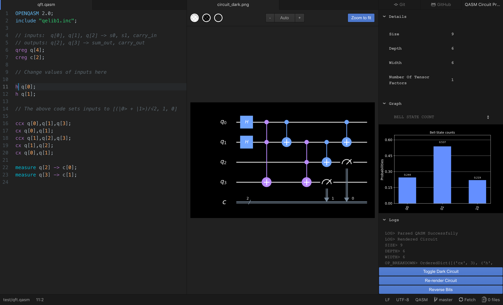

# Atom QASM Quantum Circuit Previewer

An atom package that converts **QASM** _(Quantum Assembly)_ code into a graphical representation of the quantum circuit in real time and provides additional information on the circuit, such as depth, # of instructions and statevector visualizations.

